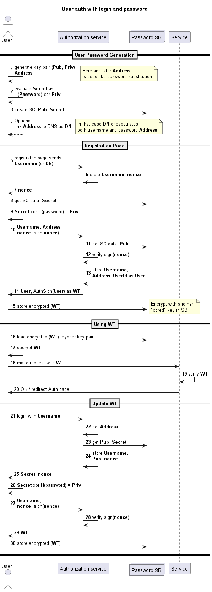

# ton-auth

## Motivation
This contract is a reserch of ton smart contracts ability to provice authentication and authorization of user on applications
and sites.

### PasswordSB
PasswordSB is a contract that stores both public and private key of the user in some way.
Public key is not modified, however private key is encrypted (in particular xored with the password hash).
With such approach user can prove that she knows the private key (corresponding to public key in the contract)
only if she knows the password. So keeping private key is not needed.
Password is never passed anywhere out of the users app or browser as with the private key it is easy to
prove that you know it.

This approach vulnerable to brute force of the password, as it is very easy to verify that password is correct, since the
public key is available and private key is secured with determined algorithm f(password, maskedPK) -> privateKey
But for not valuable assets it could be useful as user no longer have to keep, remember or enter smart contract private key.

If two-factor auth is required there is a field nonce that might be set only with owners private key, that should be stored
in secure place like telephone app. In that case user must provide both password in browser form and set nonce with mobile app.

Also passwords could be easily changed with owners private key, from mobile app.

This contract in development now.

### Protocol (Draft)

## Build

### PasswordSB
`cd .\contracts\password-sb\toncli\`

`toncli run_tests`

## Deploy
`toncli deploy -n mainnet`

## Generate test message data
`fift -s .\data.fif`

## Send message
`toncli send -n testnet -a 0.03 --address "addr" --body ./fift/try.fif`